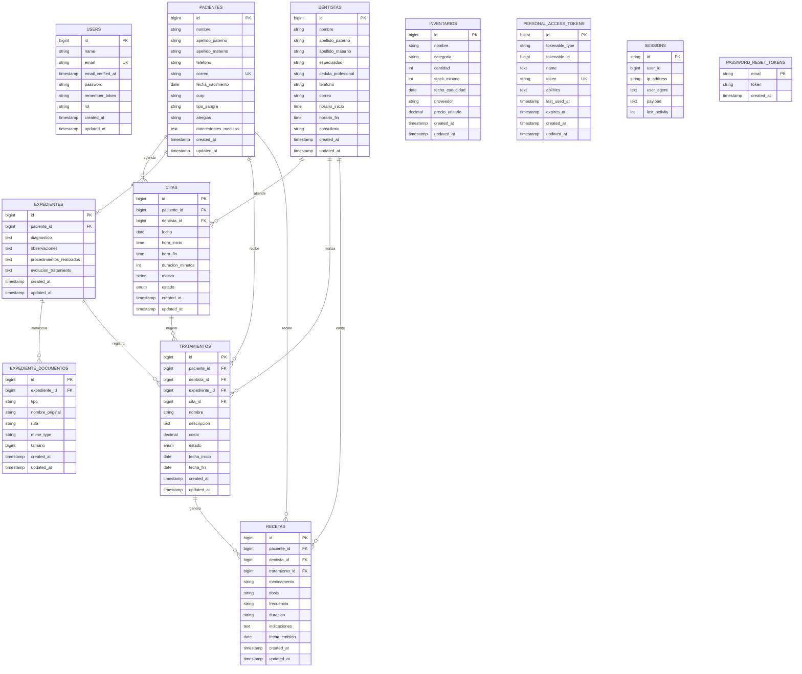

# Diagrama entidad-relacion de la base de datos

Este diagrama representa las tablas principales de la base de datos del sistema Consultorio Dental, sus campos y relaciones.



## Relaciones principales

| Tabla origen | Tabla destino | Cardinalidad | Llave foranea |
|---|---|---|---|
| `pacientes` | `citas` | 1 a muchos | `citas.paciente_id` |
| `dentistas` | `citas` | 1 a muchos | `citas.dentista_id` |
| `pacientes` | `expedientes` | 1 a 0..1 | `expedientes.paciente_id` |
| `expedientes` | `expediente_documentos` | 1 a muchos | `expediente_documentos.expediente_id` |
| `pacientes` | `tratamientos` | 1 a muchos | `tratamientos.paciente_id` |
| `dentistas` | `tratamientos` | 1 a muchos | `tratamientos.dentista_id` |
| `expedientes` | `tratamientos` | 1 a muchos | `tratamientos.expediente_id` |
| `citas` | `tratamientos` | 1 a muchos opcional | `tratamientos.cita_id` |
| `pacientes` | `recetas` | 1 a muchos | `recetas.paciente_id` |
| `dentistas` | `recetas` | 1 a muchos | `recetas.dentista_id` |
| `tratamientos` | `recetas` | 1 a muchos opcional | `recetas.tratamiento_id` |

## Tablas de soporte de Laravel

Ademas de las tablas del negocio, Laravel crea tablas internas:

| Tabla | Uso |
|---|---|
| `users` | Usuarios que inician sesion en el sistema. |
| `sessions` | Sesiones web activas. |
| `password_reset_tokens` | Tokens para restablecer contrasenas. |
| `personal_access_tokens` | Tokens de Laravel Sanctum. |
| `cache` y `cache_locks` | Cache interna de Laravel. |
| `jobs`, `job_batches`, `failed_jobs` | Colas de trabajo de Laravel. |

## Observacion

El sistema actualmente no tiene una tabla pivote para una relacion muchos a muchos. Si necesitas demostrar ese requisito en base de datos, convendria agregar una tabla como:

```text
dentista_especialidad
- id
- dentista_id
- especialidad_id
- created_at
- updated_at
```

Esa tabla permitiria que un dentista tenga varias especialidades y que una especialidad pertenezca a varios dentistas.
