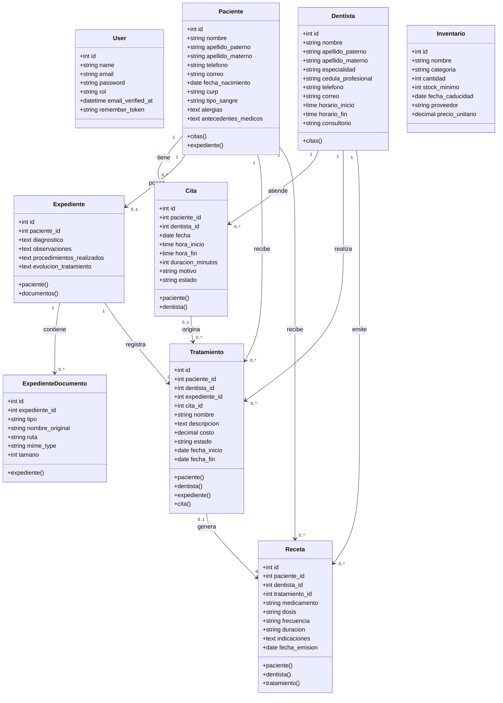

# Diagrama UML de clases - Consultorio Dental

Este diagrama representa las clases principales del sistema y sus relaciones Eloquent.



## Relaciones principales

| Relacion | Tipo | En Laravel |
|---|---|---|
| Paciente - Expediente | Uno a uno | `Paciente::hasOne(Expediente::class)` |
| Paciente - Cita | Uno a muchos | `Paciente::hasMany(Cita::class)` |
| Dentista - Cita | Uno a muchos | `Dentista::hasMany(Cita::class)` |
| Cita - Paciente | Muchos a uno | `Cita::belongsTo(Paciente::class)` |
| Cita - Dentista | Muchos a uno | `Cita::belongsTo(Dentista::class)` |
| Expediente - Documento | Uno a muchos | `Expediente::hasMany(ExpedienteDocumento::class)` |
| Tratamiento - Paciente | Muchos a uno | `Tratamiento::belongsTo(Paciente::class)` |
| Tratamiento - Dentista | Muchos a uno | `Tratamiento::belongsTo(Dentista::class)` |
| Tratamiento - Expediente | Muchos a uno | `Tratamiento::belongsTo(Expediente::class)` |
| Tratamiento - Cita | Muchos a uno | `Tratamiento::belongsTo(Cita::class)` |
| Receta - Paciente | Muchos a uno | `Receta::belongsTo(Paciente::class)` |
| Receta - Dentista | Muchos a uno | `Receta::belongsTo(Dentista::class)` |
| Receta - Tratamiento | Muchos a uno | `Receta::belongsTo(Tratamiento::class)` |

## Nota sobre muchos a muchos

Actualmente el proyecto no tiene una relacion muchos a muchos implementada con `belongsToMany`.

Una opcion recomendable seria agregar:

- `Dentista` muchos a muchos `Especialidad`
- `Paciente` muchos a muchos `Alergia`
- `Tratamiento` muchos a muchos `Insumo`

Ejemplo conceptual:

```php
public function especialidades()
{
    return $this->belongsToMany(Especialidad::class);
}
```

Con eso el proyecto podria demostrar los tres tipos principales de relaciones ORM: uno a uno, uno a muchos y muchos a muchos.
