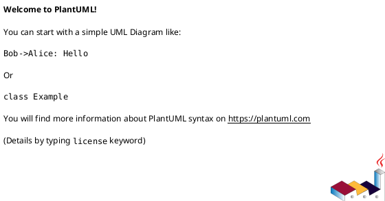

# Diagramas PlantUML

Estos archivos contienen diagramas importantes del proyecto en formato PlantUML.

| Archivo | Tipo de diagrama | Para que sirve |
|---|---|---|
| `01_clases.puml` | Clases | Muestra modelos, atributos y relaciones principales. |
| `02_entidad_relacion.puml` | Entidad-relacion | Muestra tablas, columnas, llaves primarias y foraneas. |
| `03_casos_de_uso.puml` | Casos de uso | Muestra que acciones realiza cada tipo de usuario. |
| `04_componentes.puml` | Componentes | Explica la arquitectura Laravel MVC del sistema. |
| `05_secuencia_crear_cita.puml` | Secuencia | Explica el flujo para crear una cita. |
| `06_despliegue_actual_y_objetivo.puml` | Despliegue | Compara la infraestructura actual contra la alta disponibilidad requerida. |
| `07_paquetes_mvc.puml` | Paquetes | Organiza el sistema por capas MVC y persistencia. |
| `08_robustez_crear_expediente.puml` | Robustez | Usa boundary/control/entity para crear expediente con documentos. |
| `09_estado_cita.puml` | Estados | Define el ciclo de vida de una cita. |
| `10_actividad_agendar_cita.puml` | Actividad | Describe el proceso de agendar una cita. |
| `11_secuencia_login.puml` | Secuencia | Explica el flujo de inicio de sesion. |
| `12_componentes_detallado.puml` | Componentes UML | Muestra componentes, interfaces y dependencias. |
| `13_despliegue_uml.puml` | Despliegue UML | Propone la infraestructura con alta disponibilidad. |
| `14_modelo_dominio_resumido.puml` | Modelo de dominio | Resume las entidades principales del negocio. |

## Como visualizarlos

Puedes usar una extension de VS Code como "PlantUML" o pegar el contenido en un visor PlantUML.

Cada archivo empieza con:



Y termina con:

```plantuml
@enduml
```
